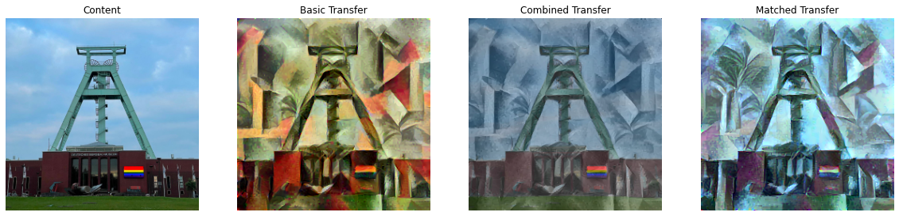
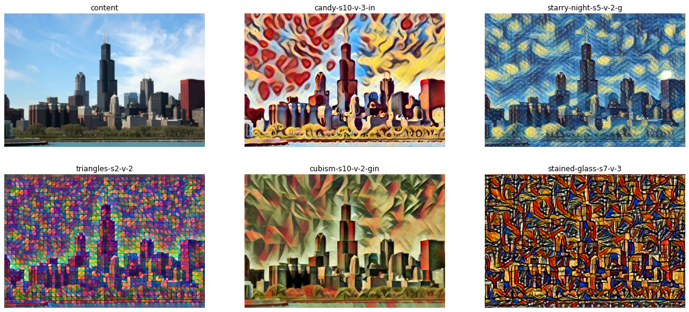
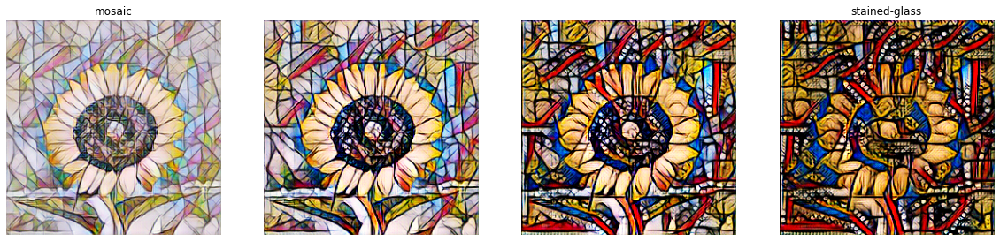

= Neural Style Transfer
Malte Dehling <mdehling@gmail.com>

:imagesdir: https://raw.githubusercontent.com/mdehling/neural-style-transfer/main/

:nbviewer: https://nbviewer.org/github/mdehling/neural-style-transfer/blob/main

:gatys2015:     {nbviewer}/gatys2015.ipynb
:johnson2016:   {nbviewer}/johnson2016.ipynb
:dumoulin2017:  {nbviewer}/dumoulin2017.ipynb

NOTE: The notebooks in this repository contain lots of images and, as a
result, are fairly large.  GitHub's notebook viewer will time out when trying
to open them, so the links below use https://nbviewer.org/[nbviewer.org]
instead.

In 2015, Gatys, Ecker, and Bethge published two articles that started the
neural network approach to texture synthesis and neural style transfer:
_Texture Synthesis Using Convolutional Neural Networks_ and _A Neural
Algorithm of Artistic Style_.  Their key insight was that correlations between
filter responses in layers of a convolutional neural networks trained for
image recognition are a good measure of style/texture.  They use an
optimization approach to iteratively produce an image matching the style of
one given image and the content of another.  In {gatys2015}[gatys2015.ipynb] I
reproduce their results and go through some of the improvements suggested in
later works such as the color matching displayed in the image below.

In 2016, Johnson, Alahi, and Fei-Fei proposed a way to do fast neural style
transfer in their article _Perceptual Losses for Real-Time Style Transfer and
Super-Resolution_.  Their idea was to train, given a style image, a residual
neural network to transform any content image into a stylized version of
itself using a single forward pass of the style transfer network.  To train
the network they use the MS-COCO/2014 dataset and minimize a weighted sum of
Gatys' content loss between the input and output of the network and Gatys'
style loss between the output and the given style image.  In the notebook
{johnson2016}[johnson2016.ipynb] I go into more detail and provide an
implementation of this approach.  This repository contains pre-trained weights
for a range of styles as shown in the image below.

In 2017, Dumoulin, Shlens, and Kudlur published their article _A Learned
Representation for Artistic Style_ in which they modify Johnson's style
transfer network to learn multiple styles simultaneously.  They realized that
the learned filters of the style transfer network could be shared between
different styles and it is sufficient to learn a different set of
normalization parameters for each style.  To allow for this, they introduced
their conditional instance normalization layer to replace the previously used
batch or instance normalization layers.  This new style transfer network takes
an image and a vector indicating a style (or a mix of styles as in the image
below) and produces a stylized image.  In {dumoulin2017}[dumoulin2017.ipynb] I
give a bit more detail and reproduce their results.

